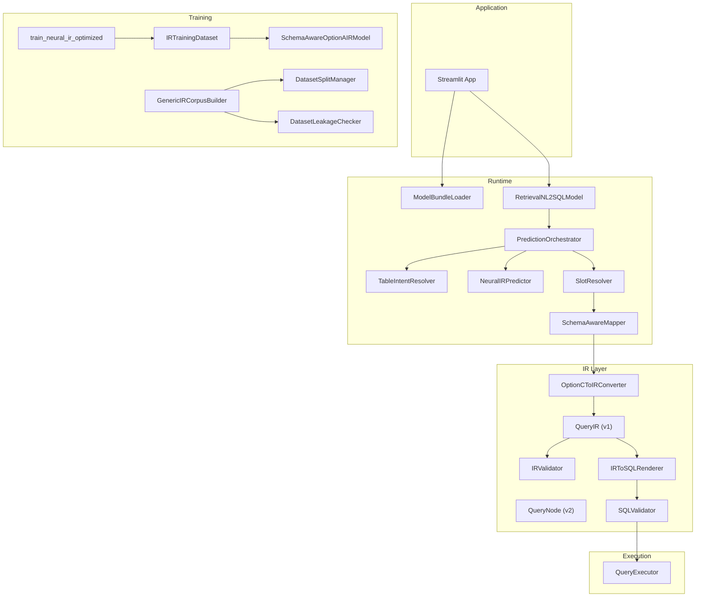

# NL2SQL System Architecture

> Generated: 2026-07-19  
> Status: Phase 0 — Baseline audit

## System Overview

The NL2SQL system converts natural language questions into SQL queries. It uses a hybrid approach combining template-based retrieval with neural QueryIR prediction, followed by deterministic SQL rendering and safety validation.

## Component Ownership Table

| Responsibility | Canonical Owner | Module Path | Notes |
|---|---|---|---|
| **Dataset Ingestion** | `DatasetLoader` | `datasets/dataset_loader.py` | Adapters for WikiSQL, Spider, BIRD |
| **Dataset Normalization** | `SchemaGraph`, `SchemaNormalizer` | `datasets/schema_normalizer.py` | Schema graph via `nl2sql_v1/schema.py` (migration target) |
| **Capability Extraction** | `SQLCapabilityExtractor` | `capabilities/` | Classifies SQL features |
| **Safety Extraction** | `task_masks["safety"]` | `neural_ir/ir_dataset.py` | Exists but zero effective supervision |
| **Partial Supervision** | `task_mask_vector()` | `neural_ir/ir_dataset.py` | Task-level masks per example |
| **Task Masks** | `TASK_MASK_KEYS` | `neural_ir/ir_dataset.py` | 13 mask dimensions |
| **Training Dataset** | `IRTrainingDataset` | `neural_ir/ir_dataset.py` | |
| **Batch Collation** | `collate_ir_batch()` | `neural_ir/ir_dataset.py` | |
| **Training Loop** | `run_optimized_training()` | `training/train_neural_ir_optimized.py` | Primary training entry |
| **Model Architecture** | `SchemaAwareOptionAIRModel` | `neural_ir/attention_model.py` | BiGRU + pointer networks |
| **Loss Computation** | `MultiTaskLossWeighter` | `neural_optimization/loss_weighter.py` | Per-head weighted loss |
| **Checkpoint Selection** | `CheckpointManager` | `neural_optimization/checkpoint_manager.py` | |
| **Early Stopping** | `EarlyStopping` | `neural_optimization/early_stopping.py` | **BUG: reporting incorrect** |
| **Hard-Negative Mining** | `HardNegativeCorpusBuilder` | `dataset_training/hard_negative_corpus_builder.py` | |
| **Hard-Negative Loss** | `_hard_negative_loss()` | `training/train_neural_ir_optimized.py` | **BUG: 0 batches used** |
| **Curriculum** | `CurriculumBuilder` | `dataset_training/curriculum_builder.py` | |
| **Split Management** | `DatasetSplitManager` | `dataset_training/split_manager.py` | 6 canonical splits |
| **Leakage Detection** | `DatasetLeakageChecker` | `dataset_training/leakage_checker.py` | **BUG: trainer calls stale API** |
| **QueryIR Model (v1)** | `QueryIR` | `ir/query_ir_models.py` | Active for runtime rendering |
| **QueryIR Model (v2)** | `QueryNode` | `ir/query_ir_v2_models.py` | Advanced: typed literals, expressions |
| **QueryIR Validation** | `IRValidator`, `QueryIRV2Validator` | `ir/ir_validator.py`, `ir/query_ir_v2_validation.py` | Dual validators |
| **QueryIR Conversion** | `OptionCToIRConverter` | `ir/option_c_to_ir.py` | Retrieval slots → QueryIR |
| **SQL Renderer** | `IRToSQLRenderer` | `ir/ir_to_sql_renderer.py` | QueryIR → SQL |
| **SQL Validator** | `SQLValidator` | `validation/sql_validator.py` | AST + schema validation |
| **Database Executor** | `execute_select()` | `execution/query_executor.py` | SELECT-only enforcement |
| **Retrieval** | `TfidfRetriever` | `nl2sql_v1/retriever.py` | **Migration target** |
| **Reranking** | `CandidateReranker` | `inference/candidate_reranker.py` | |
| **Confidence** | `PredictionConfidenceCalculator` | `inference/prediction_confidence.py` | |
| **Abstention** | `PredictionOrchestrator._forced_abstention_reason()` | `inference/prediction_orchestrator.py` | |
| **Bundle Loading** | `ModelBundleLoader` | `model_bundle/bundle_loader.py` | |
| **Bundle Promotion** | `BundlePromoter` | `model_bundle/bundle_promoter.py` | |
| **Runtime Prediction** | `PredictionOrchestrator.predict()` | `inference/prediction_orchestrator.py` | |
| **Streamlit Invocation** | `_load_model_from_bundle()` | `app/streamlit_app.py` | Direct model instantiation |

## Architectural Diagram

## Known Architectural Issues

1. **Dual QueryIR models**: `QueryIR` (v1) and `QueryNode` (v2) both active. Target: v2 becomes canonical.
2. **nl2sql_v1 deep embedding**: 50+ imports from legacy module across core runtime.
3. **No service facade**: Streamlit directly constructs orchestrator + model.
4. **Hard negative pipeline broken**: Data loads but zero batches produce loss.
5. **Safety head zero supervision**: Head exists but no positive training examples.
6. **Leakage checker stale API**: Trainer calls non-existent `check_leakage()` method.
