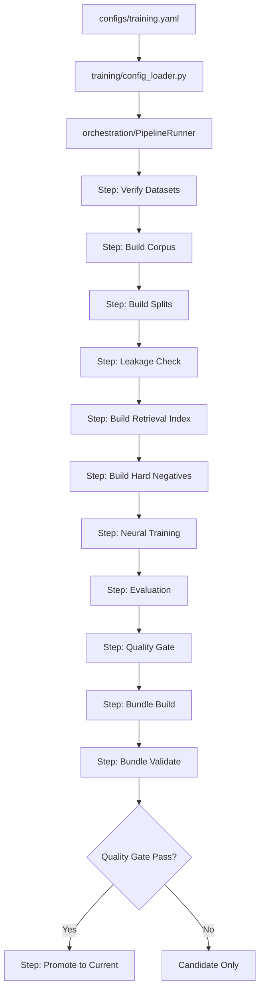

# Model Training Flow

> Generated: 2026-07-19  
> Canonical entry point: `training/train_model.py --config configs/training.yaml`

## End-to-End Pipeline



## Data Flow

```
Source Datasets (WikiSQL, Spider, BIRD)
    ↓ datasets/dataset_loader.py + adapters
Raw Examples (~93K available)
    ↓ dataset_training/ir_corpus_builder.py
SQL → QueryIR Conversion
    ↓ conversion success/failure
Supported Examples (~3,700 generic_ir)   |   Unsupported (~8,856)
    ↓ dataset_training/split_manager.py
Train / Validation / Test / Unseen-DB splits
    ↓ dataset_training/leakage_checker.py
Leakage-Checked Splits
    ↓ neural_ir/ir_dataset.py
IRTrainingDataset + Collation
    ↓ training/train_neural_ir_optimized.py
Model Training with Multi-Head Loss
    ↓ neural_optimization/checkpoint_manager.py
Best Checkpoint Selection
    ↓ model_bundle/bundle_builder.py
Model Bundle
```

## Training Data Statistics (Current)

| Source | Raw | Supported | Unsupported | Conversion Rate |
|--------|-----|-----------|-------------|-----------------|
| WikiSQL | 80,654 | ~3,075 (old) / ~65K (new) | varies | varies |
| Spider | 11,840 | ~1,475 | ~8,856 | 15.7% |
| BIRD Mini | 500 | ~169 | ~331 | 33.8% |

**Problem**: Only ~2,447 examples reach neural training. Full accounting required.

## Model Architecture

```
Input: question_ids + schema_ids + candidate_token_ids
    ↓
BiGRU Question Encoder + BiGRU Schema Encoder
    ↓
Cross-Attention (question × schema)
    ↓
Fusion Layer (question_vec, schema_vec, attended_schema)
    ↓
┌─────────────────────────────────────────────────────────────┐
│  Classification Heads          Pointer Heads                │
│  ├─ intent_head               ├─ table_pointer             │
│  ├─ metric_aggregation_head   ├─ metric_pointer            │
│  ├─ metric_expression_type    ├─ dimension_pointer          │
│  ├─ date_grain_head           ├─ date_pointer              │
│  ├─ date_filter_type_head     └─ filter_pointer            │
│  ├─ filter_operator_head                                    │
│  ├─ order_direction_head                                    │
│  └─ limit_bucket_head                                       │
└─────────────────────────────────────────────────────────────┘
```

## Known Training Issues

1. **Early stopping**: Reports `early_stopped=false` when training actually stopped early
2. **Batch size**: Reports `effective_batch_size` as micro-batch, not accounting for gradient accumulation
3. **Hard negatives**: 7,341 loaded, 7,341 matched, 0 batches produce valid loss
4. **Safety**: Head exists with zero supervision (zero positive labels)
5. **Leakage**: Trainer calls `check_leakage()` which doesn't exist on checker class
6. **Data utilization**: ~10K+ available → ~2.4K used. Partial supervision not leveraged
